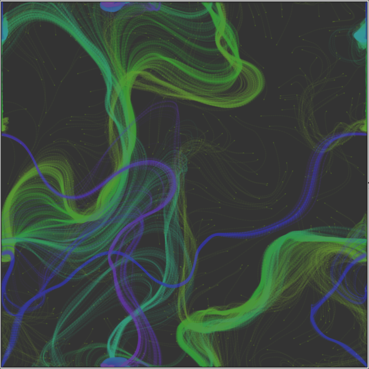

# Flow Field Visualization

This project visualizes flow fields using p5.js. It includes 1D and 2D graph visualizations and a flow field simulation.

## Project Structure
### Files and Directories

- **1d-graph.js**: Contains the code for the 1D graph visualization.
- **2d-graph.js**: Contains the code for the 2D graph visualization.
- **flow-field/**: Directory containing files related to the flow field simulation.
  - **flow-field.js**: Main file for the flow field simulation.
  - **Grid.js**: Contains the [`Grid`](command:_github.copilot.openSymbolInFile?%5B%7B%22scheme%22%3A%22file%22%2C%22authority%22%3A%22%22%2C%22path%22%3A%22%2Fhome%2Fgabechu%2FProjects%2Fperlin-noise%2Fflow-field%2FGrid.js%22%2C%22query%22%3A%22%22%2C%22fragment%22%3A%22%22%7D%2C%22Grid%22%5D "/home/gabechu/Projects/perlin-noise/flow-field/Grid.js") class which initializes and updates the flow field.
  - **Particle.js**: Contains the [`Particle`](command:_github.copilot.openSymbolFromReferences?%5B%22Particle%22%2C%5B%7B%22uri%22%3A%7B%22%24mid%22%3A1%2C%22fsPath%22%3A%22%2Fhome%2Fgabechu%2FProjects%2Fperlin-noise%2Fflow-field%2Fflow-field.js%22%2C%22external%22%3A%22file%3A%2F%2F%2Fhome%2Fgabechu%2FProjects%2Fperlin-noise%2Fflow-field%2Fflow-field.js%22%2C%22path%22%3A%22%2Fhome%2Fgabechu%2FProjects%2Fperlin-noise%2Fflow-field%2Fflow-field.js%22%2C%22scheme%22%3A%22file%22%7D%2C%22pos%22%3A%7B%22line%22%3A21%2C%22character%22%3A27%7D%7D%2C%7B%22uri%22%3A%7B%22%24mid%22%3A1%2C%22fsPath%22%3A%22%2Fhome%2Fgabechu%2FProjects%2Fperlin-noise%2Findex.html%22%2C%22external%22%3A%22file%3A%2F%2F%2Fhome%2Fgabechu%2FProjects%2Fperlin-noise%2Findex.html%22%2C%22path%22%3A%22%2Fhome%2Fgabechu%2FProjects%2Fperlin-noise%2Findex.html%22%2C%22scheme%22%3A%22file%22%7D%2C%22pos%22%3A%7B%22line%22%3A10%2C%22character%22%3A28%7D%7D%5D%5D "Go to definition") class which represents particles in the flow field.
- **index.html**: HTML file to load and run the visualizations.
- **OpenSimplexNoise.js**: Library for generating OpenSimplex noise.

## Usage

1. Open [`index.html`](command:_github.copilot.openRelativePath?%5B%7B%22scheme%22%3A%22file%22%2C%22authority%22%3A%22%22%2C%22path%22%3A%22%2Fhome%2Fgabechu%2FProjects%2Fperlin-noise%2Findex.html%22%2C%22query%22%3A%22%22%2C%22fragment%22%3A%22%22%7D%5D "/home/gabechu/Projects/perlin-noise/index.html") in a web browser.
2. The visualizations will automatically start.

## Classes

### Grid

Defined in [`flow-field/Grid.js`](command:_github.copilot.openRelativePath?%5B%7B%22scheme%22%3A%22file%22%2C%22authority%22%3A%22%22%2C%22path%22%3A%22%2Fhome%2Fgabechu%2FProjects%2Fperlin-noise%2Fflow-field%2FGrid.js%22%2C%22query%22%3A%22%22%2C%22fragment%22%3A%22%22%7D%5D "/home/gabechu/Projects/perlin-noise/flow-field/Grid.js").

- **constructor(rows, cols, cellSize)**: Initializes the grid.
- **initFlowField()**: Initializes the flow field vectors.
- **updateVectors()**: Updates the flow field vectors.
- **getVectorAt(x, y)**: Returns the vector at a given position.
- **drawVectors()**: Draws the flow field vectors.
- **drawArrow(x, y, vec, color)**: Draws an arrow representing a vector.

### Particle

Defined in [`flow-field/Particle.js`](command:_github.copilot.openRelativePath?%5B%7B%22scheme%22%3A%22file%22%2C%22authority%22%3A%22%22%2C%22path%22%3A%22%2Fhome%2Fgabechu%2FProjects%2Fperlin-noise%2Fflow-field%2FParticle.js%22%2C%22query%22%3A%22%22%2C%22fragment%22%3A%22%22%7D%5D "/home/gabechu/Projects/perlin-noise/flow-field/Particle.js").

- **constructor()**: Initializes a particle.
- **applyForce(force)**: Applies a force to the particle.
- **update()**: Updates the particle's position.
- **draw(color)**: Draws the particle.
- **ensureEdges()**: Ensures the particle stays within the canvas boundaries.

## Dependencies

- [p5.js](https://p5js.org/)
- [`OpenSimplexNoise.js`](command:_github.copilot.openRelativePath?%5B%7B%22scheme%22%3A%22file%22%2C%22authority%22%3A%22%22%2C%22path%22%3A%22%2Fhome%2Fgabechu%2FProjects%2Fperlin-noise%2FOpenSimplexNoise.js%22%2C%22query%22%3A%22%22%2C%22fragment%22%3A%22%22%7D%5D "/home/gabechu/Projects/perlin-noise/OpenSimplexNoise.js")

## License

This project is licensed under the MIT License.